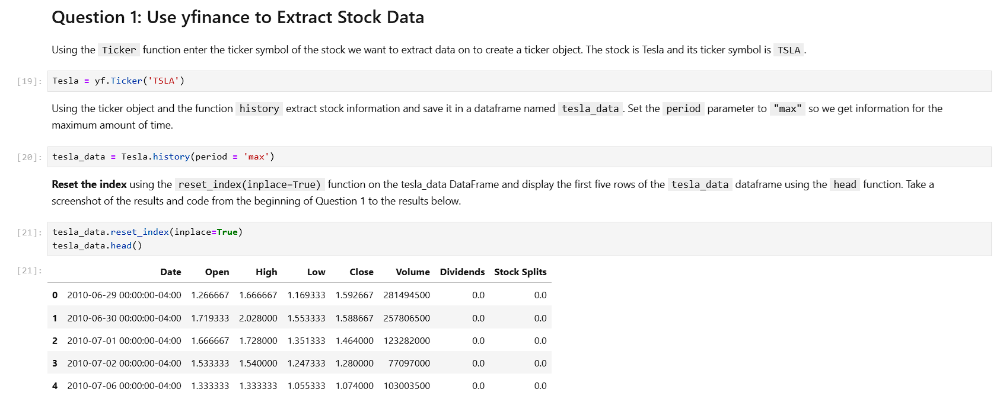
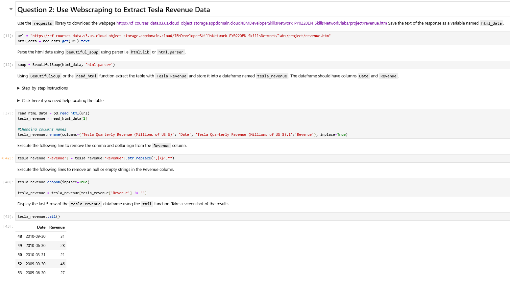
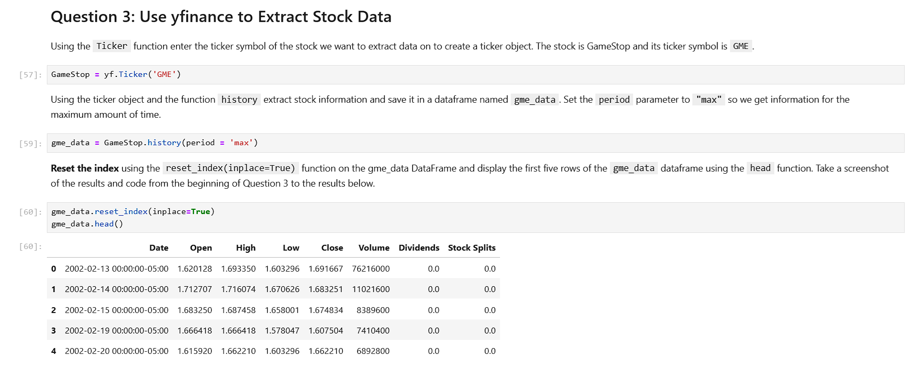
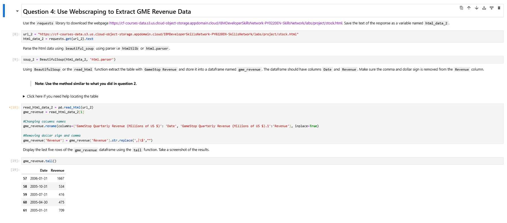
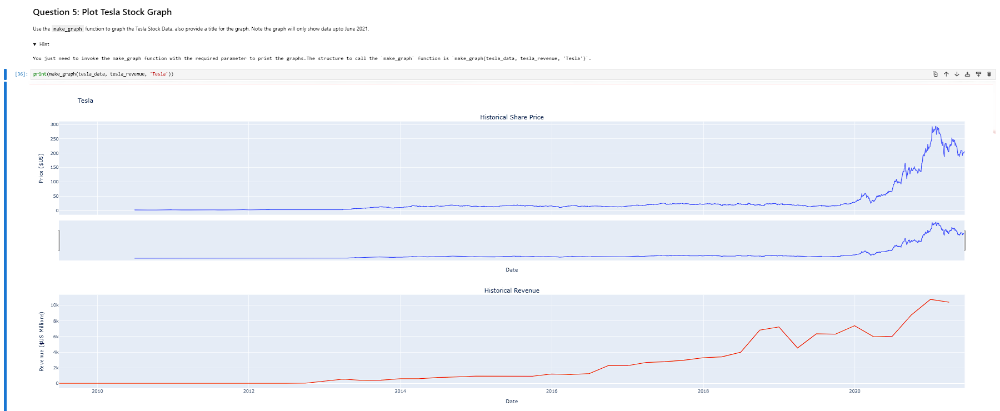
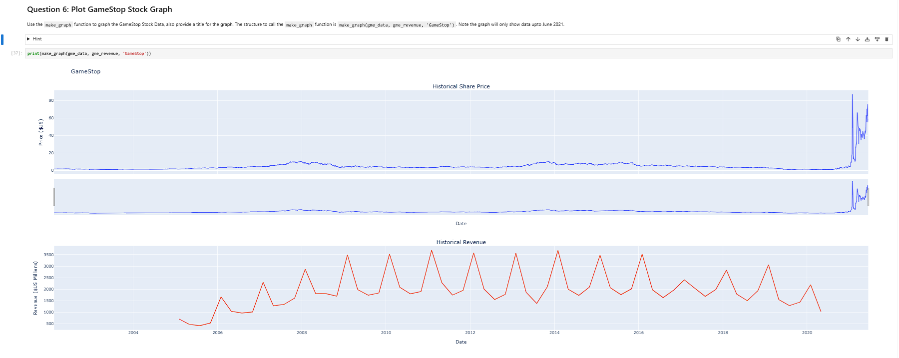

# Tesla-GmeStudio
Proyecto: Web_Scrapping con Python

Uno de los proyectos que forman parte del Curso de Ciencia de DAtos de Coursera.
Por aquí les dejo algunas capturas de pantalla del proyecto: :)

